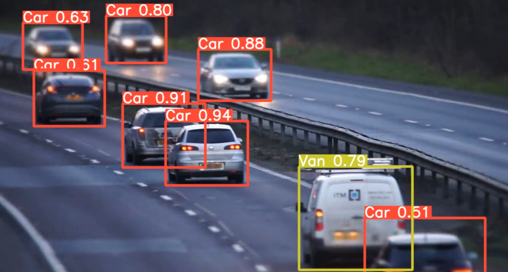

# automotive-cv



## About
This repository contains code for an automotive computer vision project using Python. The project explores object detection in images and videos captured from vehicles.

## Members

Name: Rosario Sridish  
Student Id: 25136981  
  
Name: Ali Khodr-Ali  
Student Id: 251018028  
  
Name: Jasleen Bedi  
Student Id: 251339676  
  
Name: James Suresh  
Student Id: 250782695  

## Project Goals

- Develop a system to detect objects like cars, pedestrians, and traffic signs in automotive imagery.
- Classify objects detected by computer vision systems on images/videos of automotive imagery.
- Experiment with different deep learning frameworks: TensorFlow, Keras, and PyTorch.
- Evaluate the performance of the models on various metrics.

## Technical Stack

* Python: Programming 
* TensorFlow: Deep learning framework
* Keras: High-level API for building neural networks (often used with TensorFlow)
* Torch: Another popular deep learning framework
* OpenCV: Computer vision library for image preprocessing


## Getting Started

1. Clone this repository
2. Download the `datasets` folder from [here](https://drive.google.com/drive/folders/10Swj4wJWsqonJeYEH16uhwBVhQRK7U-_) and put it in the repository 
3. Install required libraries
```
pip install opencv-python pandas numpy seaborn keras tensorflow ultralytics pickle matplotlib time random os shutil torch glob joblib warnings PIL scikit-learn scikit-image gc pathlib IPython
```
4. Run the notebooks shown in `object-and-vehicle-detection-classification` and `traffic-sign-classification`

## Links

* [https://drive.google.com/drive/folders/10Swj4wJWsqonJeYEH16uhwBVhQRK7U-_](https://drive.google.com/drive/folders/10Swj4wJWsqonJeYEH16uhwBVhQRK7U-_)
* [https://drive.google.com/drive/folders/10Swj4wJWsqonJeYEH16uhwBVhQRK7U-_](https://drive.google.com/drive/folders/10Swj4wJWsqonJeYEH16uhwBVhQRK7U-_)  


